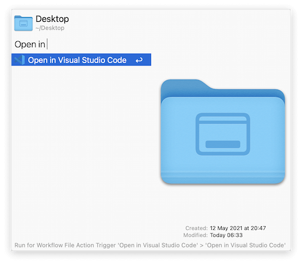
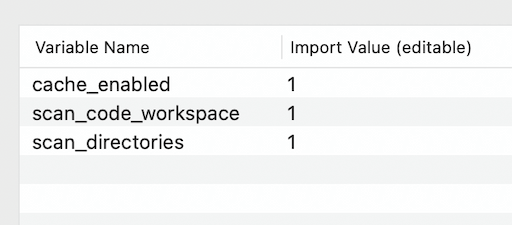
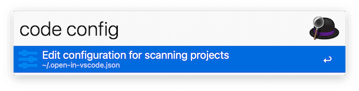

# Open in Visual Studio Code Workflow for [Alfred 4](https://www.alfredapp.com/)

This workflow provides 
searching your projects and opening them in Visual Studio Code through the keyword `code` in the search box of your Alfred.

And it also adds a File Action `Open in Visual Studio Code` in your Alfred.




## Installation

You can download this workflow from [Releases](https://github.com/hangxingliu/open-in-vscode-workflow/releases) page

**INFO:** This workflow contains Node.js scripts. If you have not installed Node.js runtime, you should download the workflow file that contains Node.js binary file. (The larger one in the Releases page) Or you can download and install [Node.js](https://nodejs.org/en/download/) before using this workflow.

### Install from Source Code

```
npm install
./scripts/install-workflow.sh
```

## Configurations

### Alfred Workflow Environment Variables

All boolean variables accept values `0`, `false`, `no` and `off` as falsy values. And they treat `1`, `true`, `yes` and `on` as true.



- `cache_enabled`: set it to falsy value to disable cache (`1` by default)
- `scan_code_workspace`: set it to falsy value to disable scanning the projects that opened in Visual Studio Code (`1` by default)
- `scan_directories`: set it to falsy value to disable scanning the directories on the disk for projects (`1` by default)

### Configuration File for Scanning



You can create a configuration file named `.open-in-vscode.json` in your home directory.   
Or you can create or edit it by keyword **code config** in Alfred. (this command creates config from example if there is not config file in your home directory)

Here is an example config:

``` json
{
  "baseDirs": [
    "~/Documents",
    "~/Projects"
  ],
  "attachDirs": [
    "/Volumes/External HDD/ExampleProject"
  ],
  "maxDepth": 3,
  "pruningName": [
    "/^[._]/",
    "node_modules",
    "cache",
    "dist",
    "logs"
  ],
  "projectFiles": [
    ".git",
    ".svn",
    ".hg",
    ".vscode",
    ".idea",
    "package.json",
    "Makefile",
    "README.md"
  ],
  "customPrefixes": {
    "/": "/",
    "~/": "~/",
    "docs/": "~/Documents/"
  }
}
```

## License

[GPL-3.0](LICENSE)

## Author

Liu Yue [@hangxingliu](https://github.com/hangxingliu)
