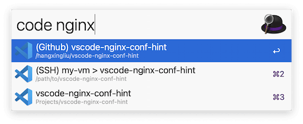

# Open in Visual Studio Code Workflow for [Alfred 5](https://www.alfredapp.com/)

> [!NOTE]
> Please check out <https://github.com/hangxingliu/open-in-vscode-workflow/tree/v1.2.0> if you are using Alfred 4.

This workflow provides a feature for you to search and open a specific project in Visual Studio Code (or related variants or Vim) from your Alfred.

And it also adds a File Action `Open in Visual Studio Code` in your Alfred.




### TODO

- [ ] Update docs

## Installation

You can download this workflow from [Releases](https://github.com/hangxingliu/open-in-vscode-workflow/releases) page

**INFO:** This workflow contains Node.js scripts. If you have not installed Node.js runtime, you should download the workflow file that contains Node.js binary file. (The larger one in the Releases page) Or you can download and install [Node.js](https://nodejs.org/en/download/) before using this workflow.


### Install from Source Code

Please ensure you have installed a Node.js development environment with a version greater than or equal to v20.x: <https://nodejs.org/en/download>

``` bash
git clone https://github.com/hangxingliu/open-in-vscode-workflow.git
cd open-in-vscode-workflow

corepack enable
yarn install

make install
# or directly call the script: ./scripts/install-workflow.sh
```

## License

[GPL-3.0](LICENSE)

## Author

Liu Yue [@hangxingliu](https://github.com/hangxingliu)
