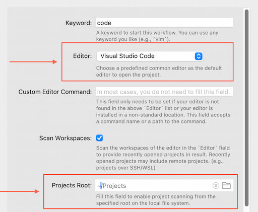

# Open in Visual Studio Code

Quickly find and open your projects in your preferred editor (Visual Studio Code, Vim, ...) from editor's history and local directories.

## Setup

Please review and fill the [Workflow’s Configuration](https://www.alfredapp.com/help/workflows/user-configuration/).
For most people, only two fields need to be configured:

- **Editor**: The default editor for opening projects 
- **Project Root:** Set a directory as the root to scanning local projects. If this field is not provided, this workflow only find projects from editor's workspaces (aka. recently opened projects).

## Usage

Find your projects via the `code` keyword by default. You can use a path or keywords from the project name to find your projects. 

- <kbd>↩</kbd> Open the selected project in the default editor, which is set in the workflow's configuration.
- <kbd>⌘</kbd> <kbd>↩</kbd> Choose an editor from the next list to open the selected project.

You can open any folder in your configured editor in [Universal Actions](https://www.alfredapp.com/help/features/universal-actions/). Holding <kbd>⌘</kbd> to open the action provided by this workflow can choose another editor to open it.

## Additional Details

- [The README file of this project](https://github.com/hangxingliu/open-in-vscode-workflow/blob/main/README.md)
